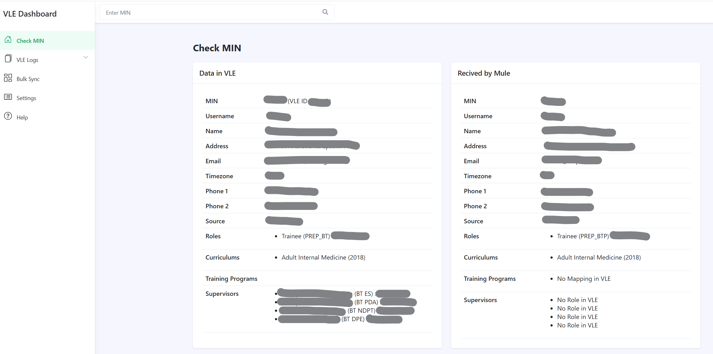

# VLE and Syncing data Comparison Dashboard

This Laravel-based dashboard allows users to compare data from a 3rd-party database against data retrieved via a collection of MuleSoft APIs. It is designed for use within a private network and does not store any data locally or require authentication.

## 🖼️ Screenshot



## 🔍 Overview

- Compare organizational MIN data between a 3rd-party database and MuleSoft APIs.
- Access via: `/dashboard/public/index.php/check_min/{MIN}`
  - Replace `{MIN}` with the user’s unique MIN.
  - Alternatively, enter the MIN in the search bar on the dashboard page.

## ⚙️ Installation

> This project requires PHP 8.1+, Composer, and Laravel 10.

1. Clone the repository:
   ```bash
   git clone https://github.com/your-username/your-laravel-dashboard.git
   cd your-laravel-dashboard
   ```

2. Install dependencies:
   ```bash
   composer install
   ```

3. Copy `.env.example` to `.env` and set your application-specific environment variables:
   ```bash
   cp .env.example .env
   php artisan key:generate
   ```

4. Configure the following files for external connections:
   - `config/database.php` – Update with 3rd-party database credentials.
   - `config/mule.php` – Set MuleSoft API URL and authentication details.

5. Serve the application:
   ```bash
   php artisan serve
   ```

   Or configure it in your web server under the `/dashboard/public` path.

## 🚫 No Authentication

This application is intended to run inside a secure private network and **does not include authentication**.

## 📦 No Internal Database

The application does not use its own database for storage or logging. All data comes directly from external sources in real-time.

## 🧩 Config Files

Ensure these files are correctly updated before use:
- `config/database.php` – For 3rd-party DB connection
- `config/mule.php` – For MuleSoft API endpoint and auth

## ✅ Features

- Live data comparison from 3rd-party DB and MuleSoft APIs.
- Search MINs via direct URL or dashboard input.
- Organized display of user details, roles, training, and supervisory data.

## 📋 TODO

- [ ] Add validation to check for non-existing MINs in the 3rd-party database.
- [ ] Implement additional pages mentioned in the menu:
  - View Logs
  - Check Q

## 📄 License

This project is licensed under the [MIT License](LICENSE).
